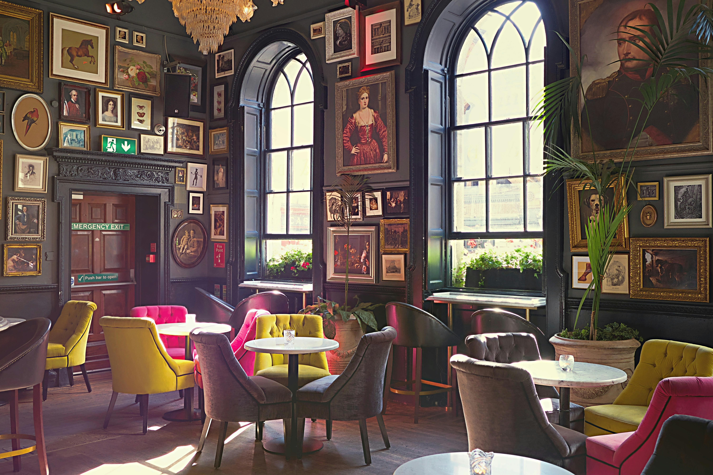
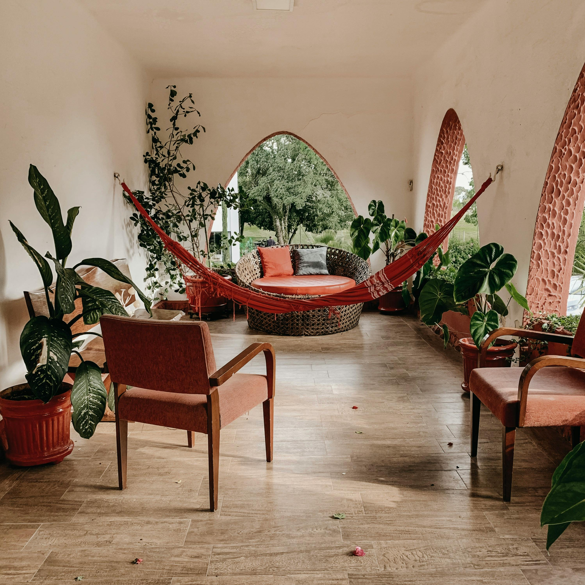

import imageHugoBetscher from '@/images/team/hugo-betscher-fondateur-hauss-paris.jpg'

export const article = {
  date: '2025-11-15',
  title: '3 Lessons We Learned Renovating Our First Space',
  description:
    'After supporting hundreds of renovation projects in Paris, we have learned valuable lessons about what really makes a difference in an interior design project.',
  author: {
    name: 'Hugo Betscher',
    role: 'Founder',
    image: { src: imageHugoBetscher },
  },
  locale: 'en',
}

export const metadata = {
  title: article.title,
  description: article.description,
}

## 1. Planning is Essential

While each project is unique, we've found that the most successful projects are those where the planning phase was carefully conducted. There is an intangible benefit to taking the time to properly define your needs before starting work, which cannot be measured in budget terms alone.

Of course, the desire to see quick results can be strong, but we've always believed that taking time for reflection upfront helps avoid many disappointments later.

<TopTip>
  Creating a detailed schedule with clear milestones is an excellent way to track your project's progress while maintaining smooth communication with your architect. Expect to hear phrases like "We're on schedule!"
</TopTip>

## 2. Choosing the Right Professional: A New Perspective

We've found that projects encountering difficulties are often those where the client didn't take time to properly choose their interior designer. Stressed and rushed, some decide to trust the first person they meet.

Fortunately for us, our network of selected architects allows us to present professionals perfectly aligned with each project's needs and style.

We've been constantly surprised by the energy and creativity these architects bring to each assignment, and we commit to only presenting professionals with solid experience and portfolios aligned with your expectations.

## 3. Budget Efficiency

With Paris's dynamic real estate market, it's essential to optimize every euro invested in your renovation project.

What we've discovered is that we can offer creative solutions that maximize visual impact without breaking the budget. For each carefully chosen decorative element, we find we can create spaces that perfectly reflect your personality. Our bespoke approach allows for informed choices at every step.

