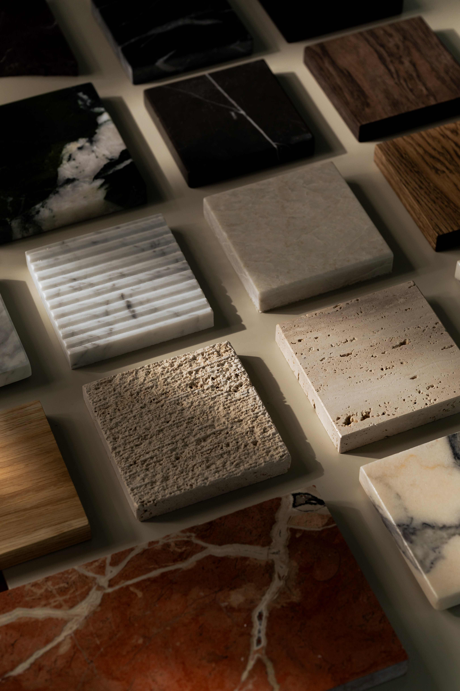

import imageHugoBetscher from '@/images/team/hugo-betscher-fondateur-hauss-paris.jpg'

export const article = {
  date: '2025-11-20',
  title: 'L\'avenir de l\'architecture d\'intérieur : nos prédictions pour 2026',
  description:
    'Explorons les dernières tendances en architecture d\'intérieur et découvrons comment elles façonneront l\'industrie dans les mois à venir.',
  author: {
    name: 'Hugo Betscher',
    role: 'Fondateur',
    image: { src: imageHugoBetscher },
  },
  locale: 'fr',
}

export const metadata = {
  title: article.title,
  description: article.description,
}

## 1. L'assistance technologique dans la conception

Avec l'émergence des outils de visualisation 3D et de réalité augmentée en 2024, l'industrie a eu un premier aperçu de ce à quoi ressemblerait la conception assistée par technologie. Ces outils ont donné à des milliers d'architectes d'intérieur ce qu'ils recherchaient toujours : la possibilité de montrer à leurs clients un rendu réaliste avant même le début des travaux.

En 2026, nous pouvons nous attendre à ce que ces assistants deviennent plus sophistiqués et que cela ait des effets d'entraînement dans toute l'industrie.

Nous prédisons que l'utilisation de maquettes physiques déclinera considérablement car les clients réalisent qu'ils peuvent désormais visualiser leur futur intérieur en temps réel. Nous nous attendons également à ce que les visites virtuelles deviennent la norme pour présenter les projets.

## 2. Les tendances de matériaux

Matériaux naturels ou synthétiques ? En 2024, les préoccupations environnementales ont décidé qu'au lieu de faire ce choix une fois pour tout un projet, il faudra désormais réfléchir à chaque matériau utilisé.

Parce que la décoration devenait trop simple, les mêmes personnes qui choisissaient les couleurs devront maintenant connaître l'impact environnemental de chaque matériau et sa durabilité.

En 2026, nous pouvons nous attendre à ce que les projets adoptent des approches de plus en plus durables, culminant avec des matériaux 100% recyclés et locaux. Nous pouvons également nous attendre à ce que les demandes de certification écologique atteignent un niveau record.

## 3. Les espaces hybrides

Parce que choisir la fonction d'une pièce était l'un des seuls domaines où un propriétaire n'était pas paralysé par le choix, au début de 2020, l'évolution des modes de vie nous a donné quelque chose de nouveau à considérer. L'émergence du télétravail a annoncé la transformation finale des espaces en lieux qui peuvent vraiment servir à plusieurs usages simultanément.

Ces nouveaux espaces hybrides signifient que nous pouvons désormais optimiser chaque mètre carré mieux que jamais. Par exemple, nous avons transformé des salons en bureaux le jour et espaces de détente le soir. Cela signifie que votre espace s'adapte réellement à vos besoins.

En 2026, nous pouvons nous attendre à ce que des solutions encore plus innovantes voient le jour, notamment des meubles modulaires intelligents, conçus spécifiquement pour s'adapter aux différents moments de la journée. Toutes ces avancées promettent de rendre l'avenir de nos intérieurs vraiment passionnant.
