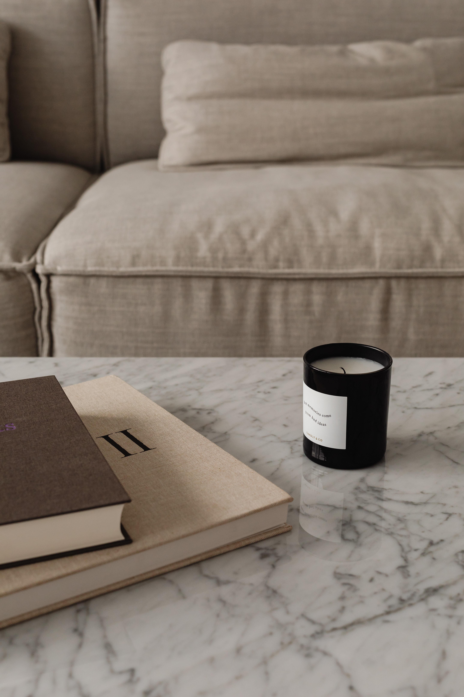

import imageHugoBetscher from '@/images/team/hugo-betscher-fondateur-hauss-paris.jpg'

export const article = {
  date: '2025-11-20',
  title: 'The Future of Founderure: Our Predictions for 2026',
  description:
    'Let\'s explore the latest trends in interior architecture and discover how they will shape the industry in the coming months.',
  author: {
    name: 'Hugo Betscher',
    role: 'Founder',
    image: { src: imageHugoBetscher },
  },
  locale: 'en',
}

export const metadata = {
  title: article.title,
  description: article.description,
}

## 1. Technological Assistance in Design

With the emergence of 3D visualization tools and augmented reality in 2024, the industry got its first glimpse of what technology-assisted design would look like. These tools gave thousands of interior designers what they had always been looking for: the ability to show their clients realistic renderings before work even begins.

In 2026, we can expect these assistants to become more sophisticated and have ripple effects throughout the industry.

We predict that the use of physical models will decline significantly as clients realize they can now visualize their future interior in real-time. We also expect virtual tours to become the norm for presenting projects.

## 2. Material Trends

Natural or synthetic materials? In 2024, environmental concerns decided that instead of making this choice once for an entire project, we now need to think about each material used.

Because decoration was becoming too simple, the same people who chose colors will now need to know the environmental impact of each material and its durability.

In 2026, we can expect projects to adopt increasingly sustainable approaches, culminating with 100% recycled and local materials. We can also expect requests for environmental certifications to reach record levels.

## 3. Hybrid Spaces

Because choosing a room's function was one of the few areas where a homeowner wasn't paralyzed by choice, in early 2020, evolving lifestyles gave us something new to consider. The rise of remote work heralded the final transformation of spaces into places that can truly serve multiple purposes simultaneously.

These new hybrid spaces mean we can now optimize every square meter better than ever. For example, we've transformed living rooms into offices during the day and relaxation spaces in the evening. This means your space truly adapts to your needs.

In 2026, we can expect even more innovative solutions to emerge, including smart modular furniture, designed specifically to adapt to different times of day. All these advances promise to make the future of our interiors truly exciting.

