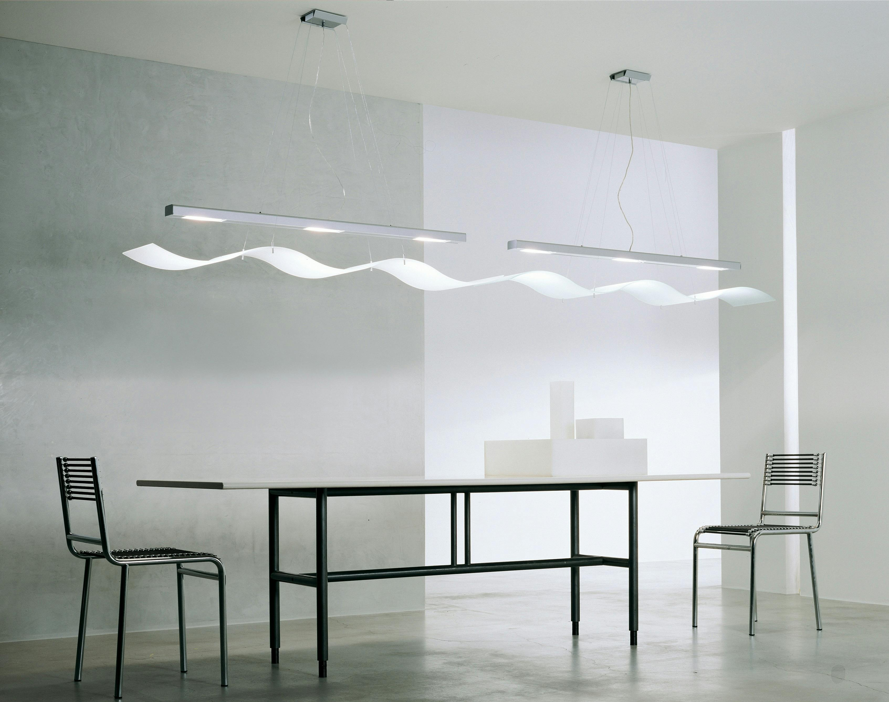

import imageHugoBetscher from '@/images/team/hugo-betscher-fondateur-hauss-paris.jpg'

export const article = {
  date: '2025-11-10',
  title: 'Un guide court pour choisir votre style d\'intérieur',
  description:
    'En tant que propriétaire ou locataire, le plus important aspect de votre projet est de définir votre style. Il ne s\'agit pas seulement d\'être descriptif et clair, mais aussi de se faire plaisir et d\'être créatif.',
  author: {
    name: 'Hugo Betscher',
    role: 'Fondateur',
    image: { src: imageHugoBetscher },
  },
  locale: 'fr',
}

export const metadata = {
  title: article.title,
  description: article.description,
}

## 1. La simplicité est la clé

Le temps est précieux, ne le gaspillez pas à hésiter entre des styles trop complexes. Une approche efficace est de commencer par définir quelques mots-clés qui vous correspondent vraiment.

Besoin d'un style moderne ? Optez pour "contemporain". Un style classique ? Pourquoi pas "traditionnel" ? Vous gagnerez un temps précieux et vous bénéficierez de l'avantage d'avoir une direction claire dès le départ. C'est ce qu'on appelle avoir une vision.

## 2. Bien se positionner dans la recherche

Lorsque vous travaillez sur un projet avec plusieurs intervenants, il est important que votre style soit facilement identifiable et compréhensible par tous.

Une façon de se démarquer est d'inclure tous les éléments de recherche possibles dans votre brief. Au lieu de simplement dire "moderne", vous pourriez préciser "moderne scandinave avec touches industrielles et matériaux naturels", ce qui garantira que votre architecte comprendra exactement vos attentes. Pour suivre les dernières innovations en matière de design, consultez notre article sur les [tendances décoration 2026](/fr/blog/tendances-decoration-2026).

## 3. Mélanger les influences

Si vous vivez à Paris, il est probable que vous soyez influencé par différentes cultures et pourtant votre intérieur peut avoir une identité forte.

Vous pouvez créer un moodboard qui rassemble toutes les différentes influences qui vous plaisent. Besoin d'inspiration méditerranéenne ? Regardez du côté de "Provençal". Un style asiatique ? Explorez "Japonais minimaliste". Vous découvrirez de nouveaux univers tout en créant un espace qui vous ressemble vraiment. Nos services de [décoration](/fr/services/decoration) et d'[ameublement](/fr/services/ameublement) peuvent vous aider à concrétiser votre vision.

