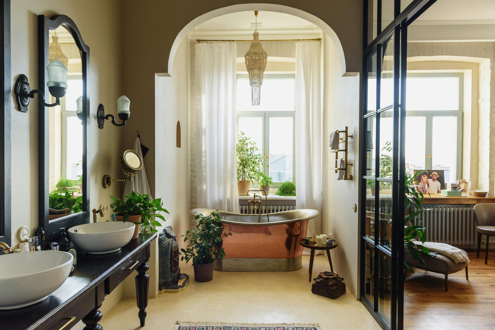

import imageHugoBetscher from '@/images/team/hugo-betscher-fondateur-hauss-paris.jpg'

export const article = {
  date: '2025-11-10',
  title: 'A Short Guide to Choosing Your Interior Style',
  description:
    'As a homeowner or tenant, the most important aspect of your project is defining your style. It\'s not just about being descriptive and clear, but also about enjoying yourself and being creative.',
  author: {
    name: 'Hugo Betscher',
    role: 'Founder',
    image: { src: imageHugoBetscher },
  },
  locale: 'en',
}

export const metadata = {
  title: article.title,
  description: article.description,
}

## 1. Simplicity is Key

Time is precious, don't waste it hesitating between overly complex styles. An effective approach is to start by defining a few keywords that truly resonate with you.

Need a modern style? Go for "contemporary." A classic style? Why not "traditional"? You'll save valuable time and benefit from having a clear direction from the start. That's what we call having a vision.

## 2. Positioning Yourself Well in Research

When working on a project with multiple stakeholders, it's important that your style is easily identifiable and understandable by all.

One way to stand out is to include all possible research elements in your brief. Instead of simply saying "modern," you could specify "Scandinavian modern with industrial touches and natural materials," which will ensure your architect understands exactly what you expect.

## 3. Mixing Influences

If you live in Paris, you're likely influenced by different cultures, yet your interior can have a strong identity.

You can create a mood board that brings together all the different influences you like. Need Mediterranean inspiration? Look toward "Provençal." An Asian style? Explore "Japanese minimalist." You'll discover new worlds while creating a space that truly reflects who you are.

